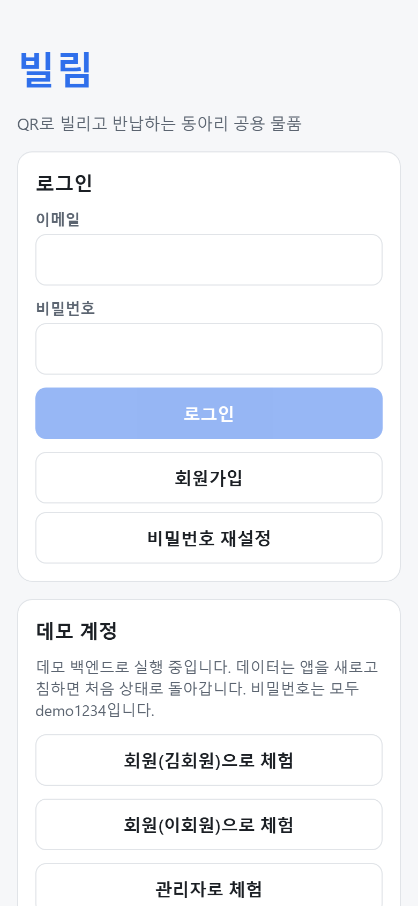
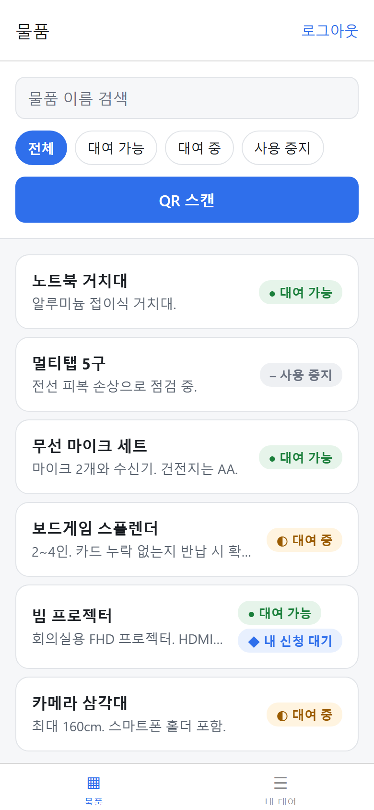
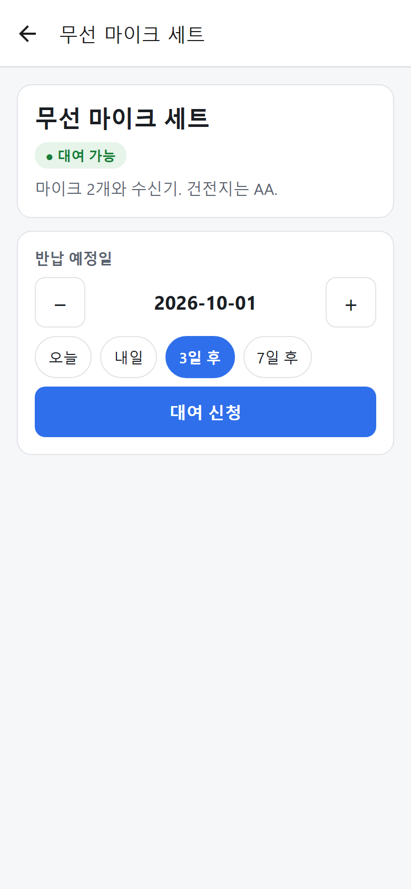
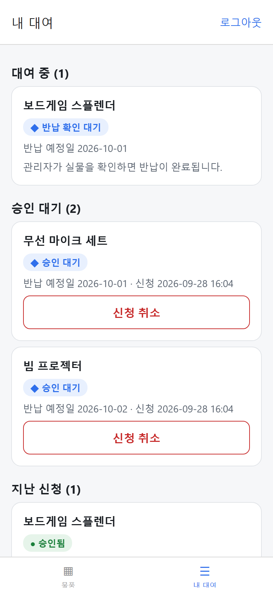
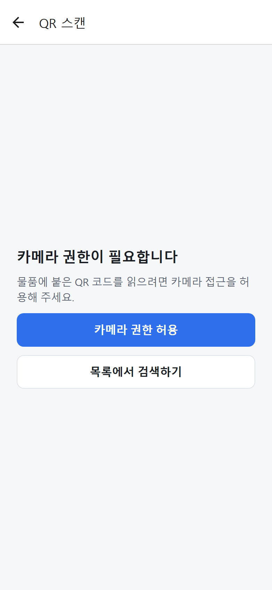
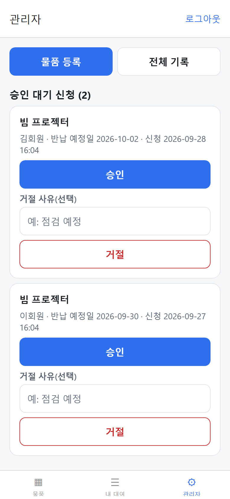
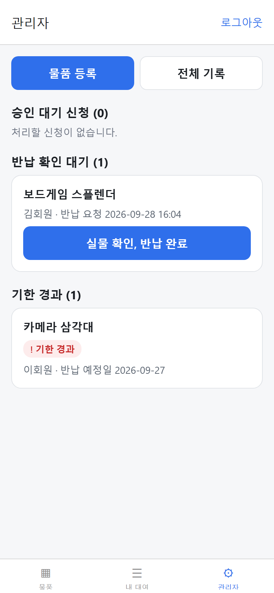
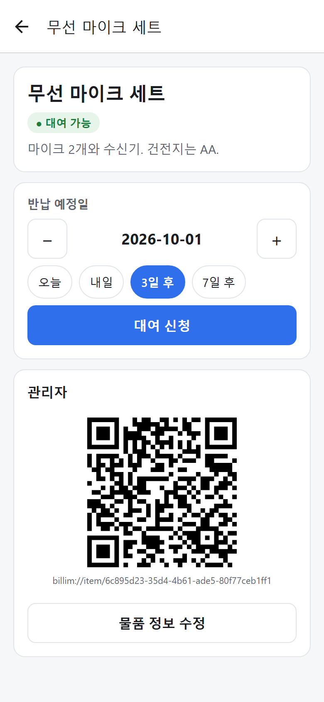

https://github.com/user-attachments/assets/db78ccb4-741f-478d-b7a7-777948950a53
# 빌림 — QR 기반 공동 물품 대여 앱

동아리·스터디가 공동 물품을 QR로 대여·반납하고, 누가 무엇을 가지고 있는지 추적하는 React Native(Expo) 앱입니다.
프론트엔드 포트폴리오 프로젝트로, TDD로 개발했습니다.

| 로그인 | 물품 목록 | 물품 상세·신청 | 내 대여 |
|---|---|---|---|
|  |  |  |  |

| 스캔 권한 | 관리자 | 승인 후(자동 거절) | 관리자 QR |
|---|---|---|---|
|  |  |  |  |

| 관리자 화면 |
https://github.com/user-attachments/assets/30b56ec9-d5b6-4d04-8ede-2d4eaa95fd5c

| 회원 화면 |
https://github.com/user-attachments/assets/77ba736c-9dcc-4d5d-97a5-91a68d667370


## 바로 실행하기

```bash
npm install
npx expo start --web     # 브라우저: http://localhost:8081
npx expo start           # 휴대폰: Expo Go 앱으로 터미널의 QR 스캔 (같은 와이파이)
```

`.env.local`이 없으면 **데모(메모리) 백엔드**로 실행되고, 로그인 화면의 데모 계정 버튼으로 바로 들어갈 수 있습니다.
`.env.local`에 Supabase 값을 넣으면(`.env.example` 참고) 실제 서버를 쓰며, 여러 기기가 같은 데이터를 봅니다.

| 계정 | 역할 | 비밀번호 |
|---|---|---|
| member@billim.dev | 회원(김회원) | demo1234 |
| member2@billim.dev | 회원(이회원) | demo1234 |
| admin@billim.dev | 관리자(박관리) | demo1234 |

Supabase 설정 절차는 `docs/ai/13_deploy_runbook/` 참조(스키마: `supabase/migrations/`).

## 주요 기능

- 이메일 로그인·가입·비밀번호 재설정, 회원/관리자 역할
- 물품 검색·상태 필터, QR 스캔으로 상세 이동(권한 거부·잘못된 QR·연속 감지 처리)
- 반납 예정일 선택 후 대여 신청, 신청 취소
- 관리자 승인·거절(사유), 반납 요청 → 관리자 반납 확인, 기한 경과 표시
- 관리자 물품 등록·수정·사용 중지, 물품별 QR 표시, 전체 기록

## 설계에서 신경 쓴 점

- **동시 승인**: 두 관리자가 같은 물품의 다른 신청을 동시에 승인해도 대여는 한 건만 확정됩니다.
  SQL은 물품 행 잠금 + 부분 유니크 인덱스로, 데모 백엔드는 검사·변경을 한 동기 구간에 묶어 보장하고,
  `src/api/__tests__/demoApi.test.ts`에서 `Promise.allSettled`로 검증합니다. 진 쪽은 `CONFLICT` 문구를 보고 목록이 갱신됩니다.
- **상태는 계산한다**: 물품의 대여 상태를 저장하지 않고 대여 기록에서 계산해 두 곳이 어긋나지 않게 했습니다.
- **낙관적 업데이트를 쓰지 않는다**: 승인·반납은 서버 결과가 확정된 뒤에만 화면을 바꾸고, 실패해도 관련 쿼리를 다시 불러옵니다.
- **서버에서 권한 검사**: 화면 숨김과 별개로 RLS·RPC(`is_admin()`), `profiles.role` 컬럼 권한으로 역할 상승을 막습니다.
- **두 번 탭 방지**: `SubmitButton`이 ref 잠금으로 렌더 전 연속 탭까지 막습니다.
- **접근성**: 모든 버튼에 읽을 수 있는 이름, 상태는 색+기호+글자로 표시합니다.

## 테스트 (TDD)

```bash
npm test            # Jest + React Native Testing Library
npm run typecheck
npm run test:supabase   # 실제 Supabase 통합 테스트(SUPABASE_TEST_URL·ANON_KEY·DB_URL 필요, 만든 데이터는 끝나면 삭제)
```

커밋 이력에 `test:`(실패하는 테스트) → `feat:`(통과시키는 구현) 순서가 남아 있습니다(`git log --oneline`).
QR 해석·상태 계산·날짜 검증·서버 규칙(권한·중복 신청·동시 승인·반납)·공통 컴포넌트를 테스트합니다.

## 기술 스택

Expo SDK 57 · React Native 0.86 · TypeScript · Expo Router · expo-camera · TanStack Query · Supabase · Jest · RNTL

## 문서

AI 협업 하네스 문서는 `docs/ai/`에 있습니다(요구사항 정의서, 요청문 변환본, API 계약, 데이터 모델, 화면 플레이북, 알려진 이슈).
코드는 codex로 단계별 리뷰를 받아 반영했습니다(`docs/ai/11_changelog/`).

## 알려진 한계

- 데모 백엔드는 새로고침하면 초기화되며, 기기마다 데이터가 따로입니다(시드 물품 QR은 기기 간에도 인식).
- 실시간 구독은 없고, 화면에 다시 들어오거나 앱이 포그라운드로 돌아올 때 다시 조회합니다.
- 물품 사진 업로드, 푸시 알림은 범위에서 제외했습니다.
